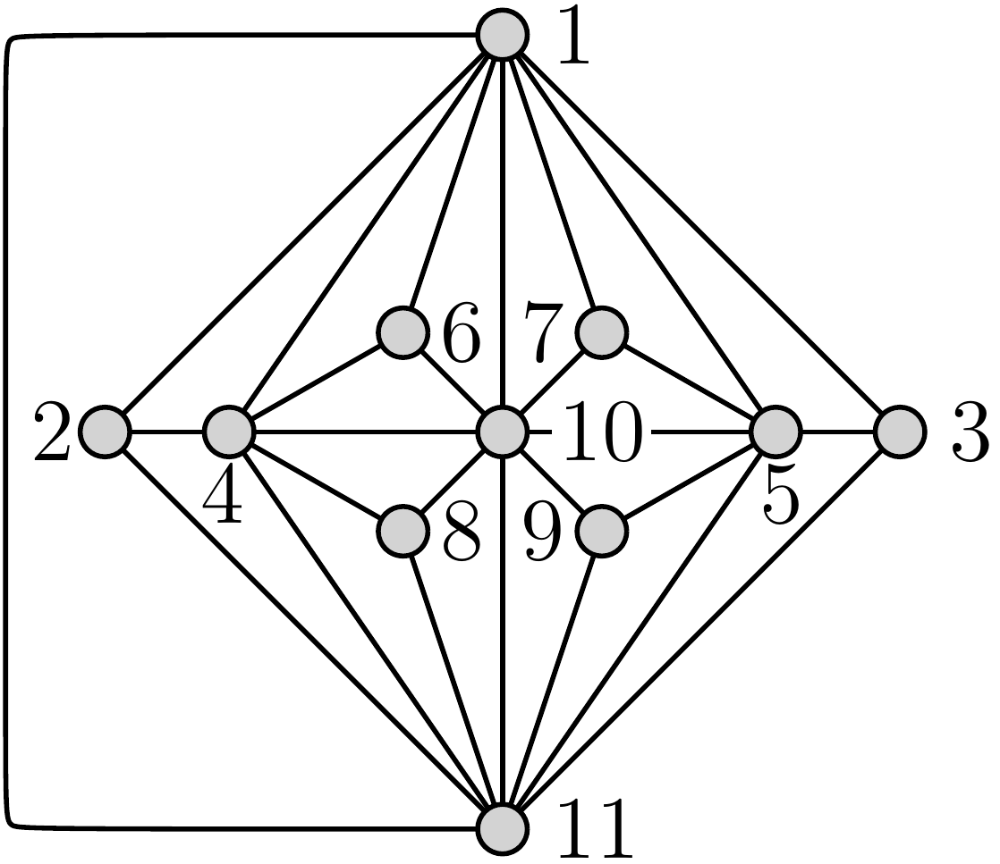
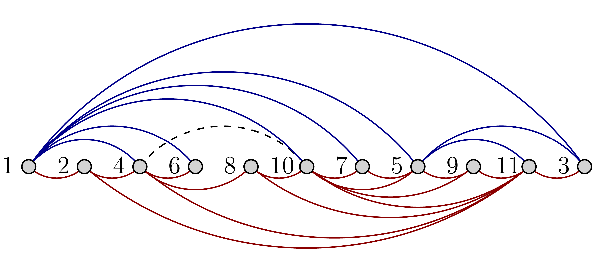
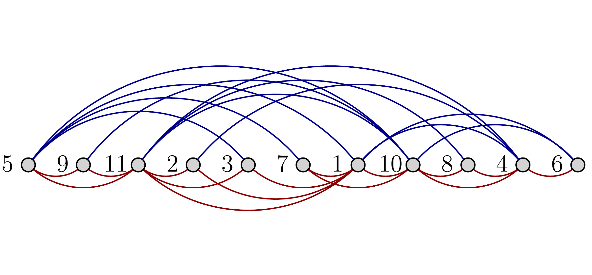
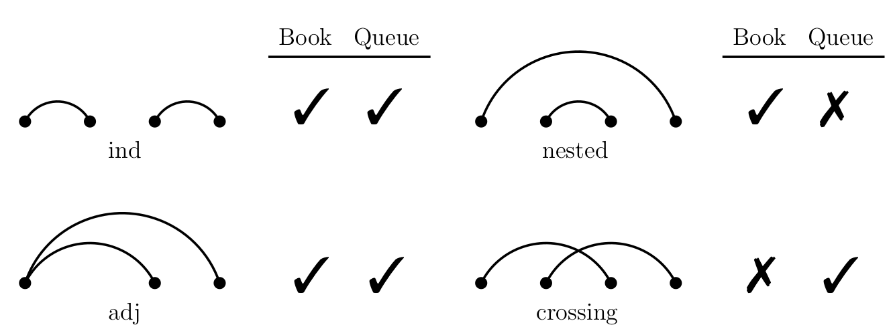
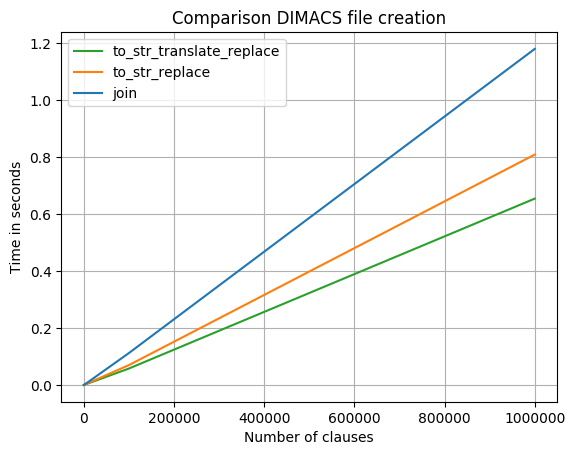
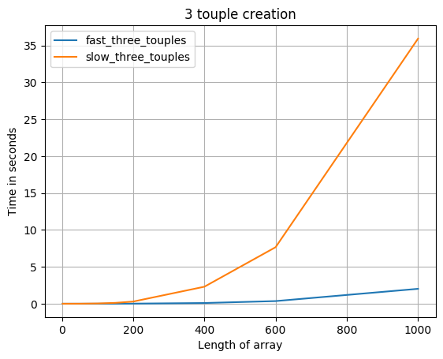

.. On ll with SAT documentation master file, created by
   sphinx-quickstart on Sat Jun 29 18:46:25 2019.
   You can adapt this file completely to your liking, but it should at least
   contain the root `toctree` directive.

####################################
On linear layouts of graphs with SAT
####################################

.. only:: html

   .. contents:: Table of Contents
      :depth: 4

**********
Motivation
**********

This the goal of this application is to find linear layouts from given graphs under the restriction of various constraints. There is an already existing tool here [#]_. But this tool is limited to finding general linear layouts with no constraints regarding individual pages or even individual graph elements. The problem is that many proofs and scientific papers about linear layouts require a specific structure of the resulting linear layout. If such a proof has to be investiged with the previous mentioned tool, it would take a lot of time to create even the graph which produces a linear layout as required. This problem is intensified by the fact that for most graphs more than on linear layout exists of which only one is interesting.

This application will help to omit this graph finding phase and directly restrict an arbitrary graph to the desired properties. For this reason the a dedicated frontend will be developed which allows graph manipulation and attaching constraints to all graph elements. This application will then accept a problem definition consisting of the graph, the arguments for the linear layout and a list of additional constraints.

To make this application even more usefull there will be no dependencies on the used frontend. Meaning anybody can use the server from whichever frontend suits their need as long as they honor the api contract.

.. [#] http://be.cs.arizona.edu/

***************************
Fundamentals and Frameworks
***************************

This chapter describes the technology and the frameworks used in the project.

REST APIs
=========

REST Interfaces or APIs are meant to provide an interface to other programs. Instead of the HTML [#]_ files normal webservice deliver a webserver providing a REST interface delivers files in the JSON [#]_ format. Like a normal webserver provides different sites at different sub URLs. E.g. "http://algo.inf.uni-tuebingen.de/?site=mitarbeiter/stud_mitarbeiter" and "http://algo.inf.uni-tuebingen.de/?site=mitarbeiter/mitarbeiter" a REST service can also provide different data at different sub URLs.

In addition to different URLs a REST API can also use the different HTTP verbs [#]_ to do different things. Per convention a request with the verb GET does read some data from the server, whereas a request with the verb POST does write data to the server. One combination of sub URL and HTTP verbs does identify a so called endpoint.

Each endpoint in a REST service has a specified JSON format in which it accepts data and a specified format in which it returns data.

The external Interface this application provides is a REST interface. For an detailed information which endpoints are available and which format they use see `the root page of the server <http://sofa.fsi.uni-tuebingen.de:5555/>`_

.. [#] https://en.wikipedia.org/wiki/HTML
.. [#] https://en.wikipedia.org/wiki/JSON
.. [#] https://en.wikipedia.org/wiki/Hypertext_Transfer_Protocol#Request_methods

Python
======

This application is implemented in python.

"Python is an easy to learn, powerful programming language. It has efficient high-level data structures and a simple but effective approach to object-oriented programming. Python’s elegant syntax and dynamic typing, together with its interpreted nature, make it an ideal language for scripting and rapid application development in many areas on most platforms.

The Python interpreter and the extensive standard library are freely available in source or binary form for all major platforms from the Python Web site, https://www.python.org/, and may be freely distributed. The same site also contains distributions of and pointers to many free third party Python modules, programs and tools, and additional documentation.

The Python interpreter is easily extended with new functions and data types implemented in C or C++ (or other languages callable from C). Python is also suitable as an extension language for customizable applications." [#]_

.. [#] https://docs.python.org/3.7/tutorial/index.html

Flask and Flask-restplus
========================

Flask is a python framework which enables a Developer to write REST services with python.

Flask-restplus is another framework which enables the Developer to easily define the data format of each REST endpoint created.

With these two Frameworks the external interface of the service is implemented. The implementation of the interface is mainly done in the class :class:`.App`

SQlite
======

SQLite is a database engine which does not need a server. Instead all the work a database server normally does is inlcuded in the SQLite client. SQLite does provide a fully featured SQL [#]_ interface. The data is stored in a single file in the SQLite file format. Typically those files have the extension `.db`. Python already contains such a SQLite client. The application stores the computed results in such a SQLite database. [#]_ The class encapsulating the database access from the rest of the application is :class:`.DataStore`

.. [#] https://en.wikipedia.org/wiki/SQL
.. [#] https://www.sqlite.org/index.html

Boolean satisfiability problem
==============================

The boolean satisfiability problem is the problem of finding a interpretation which satisfies a given boolean formula. For simple formulas such as the following, this is rather trivial.

.. math::

   A \wedge B \wedge C

But as the formula grows and introduces more variables and clauses the time to find a satisfying interpretation of the formula grows. The "boolean satisfiability problem" or short "SAT Problem" is NP-complete.

SAT Solvers try to find an interpretation of a given formula by using computers and optimized algorithms. There are also competitions for the best SAT Solver. In order to make things more easy the formula for a solver hast to be in the conjunctive normal form (CNF). [#]_ Small problem instances contain roughly 3000 variables and 80000 CNF clauses and are solved within 0.1 seconds.

In order to achieve the Goals mentioned in `Motivation`_, the application does formulate the problem as a boolean formula and passes this formula to the SAT Solver.

The translation of the problem in a boolean formula and back is task of the class :class:`.SatModel`. The actual solving of this formula is passed to the SAT Solver `lingeling <http://fmv.jku.at/lingeling/>`_

.. [#] https://en.wikipedia.org/wiki/Conjunctive_normal_form

Setup project
=============

This project requires the `lingeling` binary present on the system. Currently lingeling does only support UNIX operating
systems. So the application only runs in UNIX environments.

But also unix like environments like cygwin [#]_ or Windows Subsystem for Linux (WSL) [#]_ are supported to run lingeling as the application itself does not depend on unix but only on python which is platform independent.

.. [#] https://www.cygwin.com/
.. [#] https://en.wikipedia.org/wiki/Windows_Subsystem_for_Linux

For detailed information on how to build and run the project see the `README.md file <https://github.com/linear-layouts/SAT/blob/master/server/README.md#init-project-workspace>`_

********************
Theoretical baseline
********************

This chapter first describes linear layouts and the different types of linear layouts. Afterwards it provides insight in how the constraints from the linear layout itself and the additional constraint are encoded with SAT

Linear layout
=============

A linear layout of a graph simply states that all nodes are on one line. The interesting thing on such a layout is the order in which the nodes appear and how the edges are placed around this nodes. The two linear layouts used in the application are book embeddings and queues. The sample graph to demonstrate this two layouts will be the Goldner–Harary graph shown in this image.

.. _gh:

   Goldner–Harary graph

Book embedding
--------------

A book embedding layout in quantified in the number of pages or colors an graph needs for its book embedding. The directive of the book embedding is, that no two edges of the same color intersect. Therefor all edges represent a stack. The given graph :numref:`gh` as book embedding can be seen in :numref:`ghStack`.

.. _ghStack:

   Goldner–Harary graph as book embedding or stack

Queue embedding
---------------

A queue embedding layout of the graph shown in :numref:`gh` is show in :numref:`ghQueue`. A Queue embedding is subject to the constraint that not two edges of one color do completely enclose each other.

.. _ghQueue:

   Goldner–Harary graph as queue

:numref:`ll_sum` shows a summary on allowed patterns within linear layouts.

.. _ll_sum:

   Summary on linear layouts [#]_

.. [#] Engineering Linear Layouts with SAT, Jessica Wolz, 2018

Encoding with SAT
=================

The in `Motivation`_ defined problem gets hard to solve because of so many possible solutions. The application translates this problem to a SAT problem and let it be solved by specialized SAT solvers. This chapter describes how the Problem is encoded with SAT.

Linear layout
-------------

The basic parameters of a layout like node order or edge assignment are encoded according to chapter two of this paper [#paper]_ .

Let :math:`G = (E,V)` with :math:`V=\{v_1,v_2,\cdots,v_n\}` and :math:`E=\{e_1,e_2,\cdots,e_m\}`. :math:`p` denotes the index of the page and :math:`P` denotes all pages.

The node order is then defined as :math:`\sigma(v_i,v_j) \quad \forall v_i,v_j \in V` with pairwise distinct i,j. For :math:`\sigma` then holds asymmetry and transitivity.

The edge to page assignment of edge i to page p is denoted by :math:`\phi_p(e_i)`. Clearly has :math:`\phi_1(e_i) \vee \cdots \vee \phi_p(e_i) \forall e_i \in E` to hold to assign each edge to at least one page.

For each STACK page :math:`p` the following clauses are added to forbid alternating patterns of vertexes of e1 and e2 if all vertexes are distinct.

.. math::

   \phi_p(e_1) \wedge \phi_p(e_2) &\implies \neg (\sigma(e_1n_i, e_2n_k) \wedge \sigma(e_2n_k , e_1n_j) \wedge \sigma(e_1n_j,e_2n_l))

   \text{w.r.t:}&

   &\{e_1n_i, e_1n_j \} \in V(e_1), \{e_2n_k, e_2n_l \} \in V(e_2)

   &e_1n_i \neq e_1n_j \neq e_2n_k \neq e_2n_l

   &\forall e_1 \neq e_2 \in E

For QUEUE pages :math:`q` there are clauses added which forbid enclosing patterns.

.. math::

   \phi_q(e_1) \wedge \phi_q(e_2) &\implies \neg (\sigma(e_1n_i, e_2n_k) \wedge \sigma(e_2n_k , e_2n_l) \wedge \sigma(e_2n_l ,e_1n_j))

   \text{w.r.t:}&

   &\{e_1n_i, e_1n_j \} \in V(e_1), \{e_2n_k, e_2n_l \} \in V(e_2)

   &e_1n_i \neq e_1n_j \neq e_2n_k \neq e_2n_l

   &\forall e_1 \neq e_2 \in E

Page constraints
----------------

In addition to the type, each page can have an additional constraint.

The first of such constraints is the DISPENSABLE constraint which does restrict the order of each vertex to at most one. The coresponding clauses are:

.. math::

   \neg \phi_p(e_1) \vee \neg \phi_p(e_2)

   \text{w.r.t:}&

   & V(e_1) \cap V(e_2) \neq \{\}\quad \forall e_1,e_2 \in E

The second of such constraints is FOREST. Which enforces, that the graph on page :math:`p` is acyclic. To encode this new variables have to be introduced. One type for the parent relationship and one for the ancestor relationship. The ancestor relationship is used to forbid cyclic graphs. The detailed formulation is described in chapter 2.1 of this paper [#paper]_.

The TREE constraint is also described there. It basically adds the a additional variable to indicate if one node is the root of the tree and allows only one root.

The implementation of this constraints is located in :func:`~be.model.SatModel.add_page_constraints`

Additional constraints
----------------------

The application supports a wide variety of additional constraints the user can impose on the given problem instance. In the following the there will be a short description of the constraint in text form followed by the logical projection. The title will represent the constraint type accepted by the API. The implementation to this constraints is found in :func:`~be.model.SatModel.add_additional_constraints`.

EDGES_ON_PAGES
~~~~~~~~~~~~~~

This constraint forces the given edges :math:`E^*` to a given pages :math:`P^*`. The implementation is simply

.. math::
      \bigwedge_{p \in P^*} \phi_p(e) \quad \forall e \in E^*

EDGES_SAME_PAGES
~~~~~~~~~~~~~~~~

This constraint will force the given edges :math:`e_1,\cdots,e_n` to the same page. Because there is no general way to formulate this constraint in CNF for an arbitrary number of pages it is only implemented up to four pages. The general formulation is as follows

.. math::
   \bigvee_{p \in P} (\phi_p(e_{i-1}) \wedge \phi_p(e_i)) \quad \forall i \in [2,n]

EDGES_DIFFERENT_PAGES
~~~~~~~~~~~~~~~~~~~~~

This constraint forces all given edges :math:`E^*` on different pages. It will create unsolvable instances if more edges are given than there are pages. In this case the application will throw an error. The constraint is paiwise implemented as

.. math::
   \bigwedge_{p \in P} (\neg \phi_p(e_i) \vee  \neg \phi_p(e_j)) \quad \forall e_i \neq e_j \in E^*

EDGES_TO_SUB_ARC_ON_PAGES
~~~~~~~~~~~~~~~~~~~~~~~~~

This constraint is rather special to the proof of Yannakakis [#]_. According to the description in the proof this constraint enforces the following. If an edge has one endpoint in one of two specifically designated nodes :math:`s,t` and the other endpoint between them, then it is restricted to certain pages :math:`P^*`. The logical formula is:

.. math::
   \bigvee_{p \in P^*}(\phi_p(e)) \quad \forall e \in E \ | \  V(e) \cap \{s,t\} \neq \{\} \wedge V(e) \in [s,t]

EDGES_FROM_NODES_ON_PAGES
~~~~~~~~~~~~~~~~~~~~~~~~~
The current constraint is an less strict version of the `EDGES_TO_SUB_ARC_ON_PAGES`_ constraint. Given this constraint all edges from the given nodes :math:`V^*` to the given pages :math:`P^*`.

.. math::
   \bigvee_{p \in P^*}(\phi_p(e)) \quad \forall e \in E \ | \  V(e) \cap V^* \neq \{\}

NODES_PREDECESSOR
~~~~~~~~~~~~~~~~~
This and the following constraints apply to nodes. The current constraint does require that one set of nodes :math:`V_1^*` is before an other set of nodes :math:`V_2^*`.

.. math::
   \sigma(n_i,n_j) \quad \forall n_i \in V_1^* ; n_j \in V_2^*

NODES_ABSOLUTE_ORDER
~~~~~~~~~~~~~~~~~~~~
Whereas the previous constraint is only able to encode relative order, does this constraint encode absolute order. So no node is in between the given node order :math:`n_1,\cdots,n_j` and they apear in exactly this order. The logical encoding uses exactly this trick:

.. math::
   \sigma(n_{i-1},n_i) \wedge \left(\bigwedge_{ n_x \in V \ | \ n_i \neq n_x \neq n_{i-1}} \neg\left(\sigma(n_{n-1} , n_x) \wedge \sigma(n_x, n_i)\right)\right) \quad \forall i \in [2,j]

NODES_REQUIRE_PARTIAL_ORDER
~~~~~~~~~~~~~~~~~~~~~~~~~~~
A series of `NODES_PREDECESSOR`_ constraint with one node in each set can be expressed with this constraint. It simply enforces, that the nodes appear in the order :math:`n_1,\cdots,n_j`. The formula is as simple as it can get with:

.. math::
   \bigwedge_{i \in [2,j]}\sigma(n_{i-1}, n_i)

NODES_FORBID_PARTIAL_ORDER
~~~~~~~~~~~~~~~~~~~~~~~~~~
This encodes the opposite of `NODES_REQUIRE_PARTIAL_ORDER`_. The constraint is satified as soon as two of the nodes switch their relative position. The formula is:

.. math::
   \neg \left(\bigwedge_{i \in [2,j]}\sigma(n_{i-1}, n_i) \right)

NODES_CONSECUTIVE
~~~~~~~~~~~~~~~~~

This constraint is similar to `NODES_ABSOLUTE_ORDER`_ with two nodes but without regarding the particular order of the nodes. This constraint only requires that between the two given nodes :math:`n_1,n_2` is no other node. The corresponding formula is.

.. math::
   \sigma(n_1,n_2) \Leftrightarrow \sigma(n_i,n_1) \vee \sigma(n_2,n_i) \quad \forall n_i \in V \ | \ n_2 \neq n_i \neq n_1

.. [#paper] The Book Embedding Problem from a SAT-Solving Perspective, M. A. Bekos, et al, 2015

.. [#] M. Yannakakis. Four pages are necessary and sufficient for planar graphs (extended abstract). In J. Hartmanis, editor, ACM Symposium on Theory of Computing, pages 104–108. ACM, 1986. doi:10.1145/12130.12141

**************
Implementation
**************

This chapter describes the architecture of the application and highlights implementation details. It will first describe how the different application components work together. Then the signatures and the code comments of the core classes are included and at the end of this chapter there will be some considerations regarding the performance optimization.

Architecture
============

.. automodule:: be
   :members:

The following diagram shows how one request flows through the system. The schema flask validates against is created in :func:`~be.app.App.create_app`

.. uml::

   @startuml
   User -> flask: POST Problem\nJSON
   flask -> flask: validate schema
   flask -> app.py: post()\nJSON
   app.py -> graphml_parser.py: Parse Json
   graphml_parser.py -> app.py: Problem
   app.py -> app.py: validate Problem
   app.py -> data.py: save request(Problem)
   data.py -> app.py: id
   app.py -> solver.py: solve(Problem,id)
   solver.py -> model.py: create clauses
   model.py -> solver.py: clauses
   solver.py -> lingeling: solve clauses
   lingeling -> solver.py: solution
   solver.py -> model.py:parse solution
   model.py -> solver.py: parsed solution
   solver.py -> app.py: solution
   app.py -> data.py: save(id,solution)
   app.py -> flask: solution\nJSON
   flask -> User: solution\nJSON
   @enduml

Core Classes
============

.. automodule:: be.app
   :members:

.. autoclass:: be.model.SatModel
   :members:

The following module is the glue code between the :class:`.App`: class which handles the external interface and the :class:`.SatModel`: class which does the heavy lifting in creating the SAT clauses and calling the SAT solver.

.. automodule:: be.solver
   :members:

Auxiliary classes
=================

The parsing of the graphml string happens on a low level xml basis without constructing a graph. The only validation will be to check if the nodes referenced by the edges are actually present.

As id are taken from the following hierarchy: Userdata at the xml element, id of the xml element, for edges generated from <source node>-<target node>. This hierarchy ensures that the API can use a wide variety of valid graphml as input.

The following interface is provided:

.. automodule:: be.graphml_parser
   :members:

.. automodule:: be.data
   :members:

Performance Analysis
====================

This chapter sheds light on the particular hot spots of the application regarding technical optimization.

The Following snippet shows the time  the python interpreter needed for the different methods. This was measured by the ProfilerMiddleware [#]_ of werkzeug [#]_::

   PATH: '/embeddings'
            2387712 function calls (2381351 primitive calls) in 4.810 seconds

      Ordered by: internal time, call count
      List reduced from 617 to 30 due to restriction <30>

      ncalls  tottime  filename:lineno(function)
        5059    1.163  {method 'poll' of 'select.poll' objects}
           1    0.868  ./SAT/server/be/model.py:72(static_to_dimacs)
           5    0.668  ./SAT/server/be/model.py:728(static_encode_page_constraint_stack)
           1    0.456  ./SAT/server/be/model.py:11(static_node_order_generation)
      395040    0.415  ./SAT/server/be/model.py:53(static_get_order_clauses)
      152353    0.375  {built-in method numpy.array}
       51485    0.154  ./SAT/server/be/utils.py:45(get_duplicates)
       51485    0.110  {method 'sort' of 'numpy.ndarray' objects}
      100865    0.094  {method 'tolist' of 'numpy.ndarray' objects}
      839228    0.069  {method 'append' of 'list' objects}
           1    0.068  ./SAT/server/be/solver.py:15(solve)
       51485    0.065  {method 'copy' of 'numpy.ndarray' objects}
       51485    0.046  site-packages/numpy/core/fromnumeric.py:815(sort)
      508258    0.0410 {built-in method builtins.len}
           1    0.036  {method 'translate' of 'str' objects}
           3    0.031  {method 'commit' of 'sqlite3.Connection' objects}
          12    0.030  {method 'replace' of 'str' objects}
       50097    0.018  {method 'extend' of 'list' objects}
       51485    0.013  site-packages/numpy/core/numeric.py:541(asanyarray)
        5040    0.011  {built-in method posix.write}
           1    0.003  ./SAT/server/be/solver.py:57(_call_lingeling_with_string)
     3814/38    0.003  copy.py:132(deepcopy)
           1    0.003  ./SAT/server/be/model.py:359(add_page_constraints)
          21    0.002  {built-in method posix.read}

The `tottime` defines the time the interpreter ran this particular method without jumping to a sub method. The first line here `{method 'poll' of 'select.poll' objects}` is actually the waiting loop for the SAT solver to finish.

The first method which is self implemented is the call to `static_to_dimacs` which is why this method got fairly much attention in order to get optimized as much as possible. See sub section one of this chapter.

.. [#] https://werkzeug.palletsprojects.com/en/0.15.x/middleware/profiler/#module-werkzeug.middleware.profiler
.. [#] https://werkzeug.palletsprojects.com/en/0.15.x/

DIMACS File generation
----------------------

The figure shows that the time complexity of the problem is already linear and optimization can only aim to make the line less steep. This problem is ultimately not hard but generating a for bigger problem instances 1.5 GB big string just takes its time.

Algorithms before technology
----------------------------

The application iterates a lot over edges or nodes. Often to create permutations of two or more edges. More often than not these permutations are not sensitive to ordering. In early interations of this application to create permutations of 3 edges, there would be three loops over all the edges like this::

       for i in a:
        for j in a:
            if i == j:
                continue
            for k in a:
                if k == i or k == j:
                    continue
                # do something
                pass

The difference to the following more intelligent algorithm below should be obivous. Not only does the second algorithm only produce a fraction of the loops but the loops which are done are all used.::

    for i in range(len(a)):
        for j in range(i):
            for k in range(j):
                # do something
                pass

The difference in performance is show below.

Even with by optimising the slow algorithm to run a hundred times faster it would still not beat the intelligent algorithm. Therefor the lesson is clearly optimize algorithms before technology.

Ahead of time
-------------

Initially the application used a logic framework like sympy to generate the CNF clauses from the definition shown in `Encoding with SAT`_. This works pretty well out of the box. The problem was that the transformation to a CNF form had to be done millions of times per problem. This was realy slow. The solution was to invest some brain power to formulate the CNF clauses and use the already transformed clauses during the application. The Downside of this is for example that certain constraints like `EDGES_SAME_PAGES`_ only work for as much pages as there are predefined clauses present.

**********
Conclusion
**********

TODO
was it worth it
